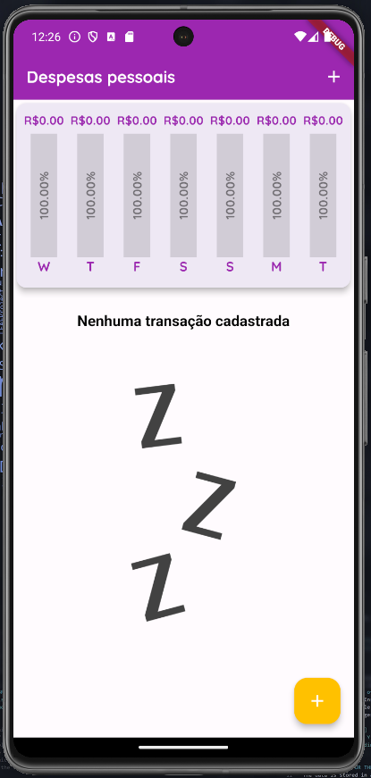
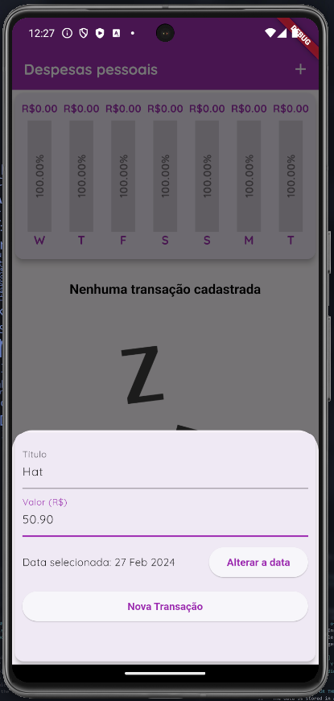
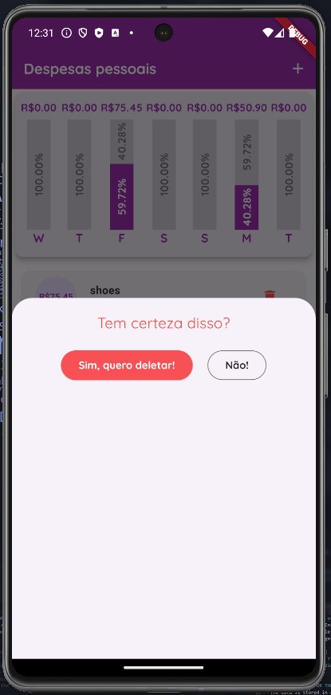
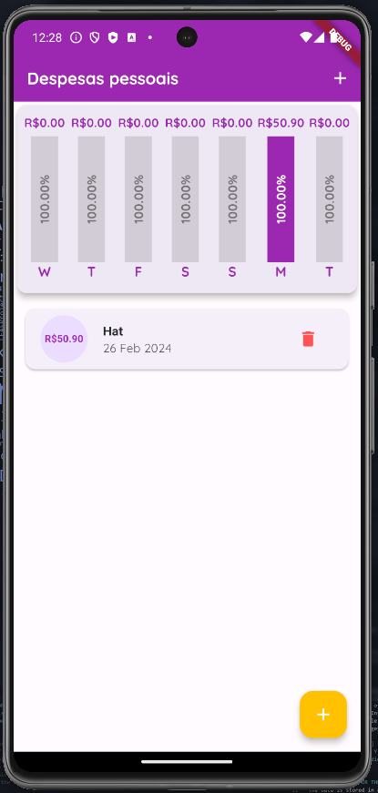
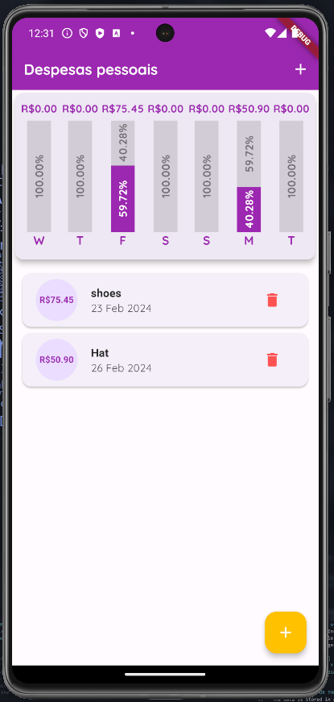

# Expenses Flutter App

 

- A small Expenses/Finances project written in Flutter.
- Without state manager
- using dummy data

 

## Screens

### Home without Expenses

### Form to add an expense

### Form to add an expense, change date

### Home with an expense

### Home with some things

### Guard to remove an expense

